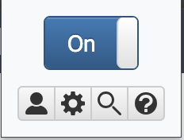
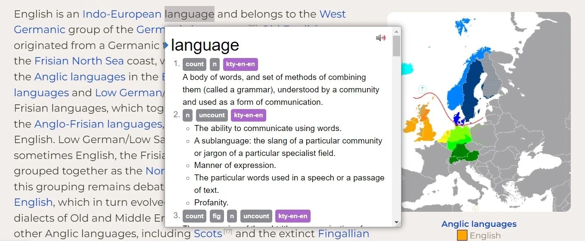

---
hide:
  - navigation
  - footer
---

# Getting Started with Yomitan

This introduction will help you quickly familiarize yourself with the basics and set you up for a smooth language learning experience.

-   :material-book-open-page-variant:{ .lg .middle } __Learn Faster__

    ---

    Hover over words to see what they mean instantly.

-   :material-cards:{ .lg .middle } __Create Flashcards__

    ---

     Send words straight to Anki in one click, exactly as you encounter them while reading.

-   :material-web:{ .lg .middle } __Works Everywhere__

    ---

    Use Yomitan on news articles, novels, subtitles, PDFs, and more.

-   :material-volume-high:{ .lg .middle } __Hear Pronunciation__

    ---

    Play native audio directly from native speakers from local sources or over the internet.

!!! note "Migrating from Yomichan?"
    Learn how to migrate to Yomitan [here](yomichan-migration.md).

---

## :fontawesome-solid-download: Installation

To get started, get Yomitan for your browser:

=== "Chrome"

    

    -   :fontawesome-brands-chrome:{ .lg .middle } __Chrome Stable__

        ---

        The stable release recommended for most users.

        [:octicons-download-16: Install from Chrome Web Store](https://chrome.google.com/webstore/detail/yomitan/likgccmbimhjbgkjambclfkhldnlhbnn){ .md-button .md-button--primary }

    -   :fontawesome-brands-chrome:{ .lg .middle } __Chrome Beta__

        ---

        Try the latest features before they reach stable.

        [:octicons-download-16: Install Beta Version](https://chrome.google.com/webstore/detail/yomitan-development-build/glnaenfapkkecknnmginabpmgkenenml){ .md-button }

    

=== "Firefox"

    

    -   :fontawesome-brands-firefox-browser:{ .lg .middle } __Firefox Stable__

        ---

        The stable release recommended for most users.

        [:octicons-download-16: Install from Mozilla Add-ons](https://addons.mozilla.org/en-US/firefox/addon/yomitan/){ .md-button .md-button--primary }

    -   :fontawesome-brands-firefox-browser:{ .lg .middle } __Firefox Beta/Development__

        ---

        Download and side-load manually for testing versions.

        [:octicons-mark-github-16: View GitHub Releases](https://github.com/yomidevs/yomitan/releases){ .md-button }

    

    !!! info "Manual Installation Required"
        Firefox doesn't allow testing extensions in the marketplace. Download your desired version and side-load it manually. You only need to do this once—updates are automatic.

=== "Edge"

    

    -   :fontawesome-brands-edge:{ .lg .middle } __Edge Stable__

        ---

        The stable release for Microsoft Edge users.

        [:octicons-download-16: Install from Edge Add-ons](https://microsoftedge.microsoft.com/addons/detail/yomitan/idelnfbbmikgfiejhgmddlbkfgiifnnn){ .md-button .md-button--primary }

    

---

:fontawesome-solid-mobile-screen-button:{ .lg .middle } ___Mobile users___: You can use Yomitan on Android with Firefox or Edge only. Chrome for mobile and iOS aren't supported.

## Yomitan Setup

After a successful installation, Yomitan will display a welcome page. If you don’t see it, that’s okay—you can complete setup at any time by opening `Settings` from the `Quick Actions` menu.

!!! info "Quick Actions"
    Click the { width="16" } **Yomitan** button in the browser bar to open the quick-actions popup.

    <figure markdown="span">
        { width="120" }
    </figure>

    

    -   { width="24" style="vertical-align: middle;" } __Profile__

        ---

        Quickly switch between profiles with different settings or languages.

        <small>To create new profiles, head to `Settings`.</small>

    -   { width="24" style="vertical-align: middle;" } __Settings__

        ---

        Your control hub. 
        
        Make profiles, configure dictionaries, switch themes, and more.

    -   { width="24" style="vertical-align: middle;" } __Search__

        ---

        Open the search page to easily look up whole sentences and more.

    -   { width="24" style="vertical-align: middle;" } __Help__

        ---

        See the relevant links and information about Yomitan.

    

### Installing Dictionaries

!!! warning "Dictionary Required"
    Yomitan requires at least one dictionary to function. An orange exclamation mark over the icon indicates no dictionaries are enabled.

To install dictionaries:

1. Navigate to Yomitan's `Welcome` or `Settings` page.
2. Choose your desired language from the `Language` dropdown. 
3. Click on `Get recommended dictionaries...`

You will see a list of publicly available Yomitan dictionaries for the selected language.
Install as many as you like — you can enable, disable, or reorder them later.

<figure markdown="span">
    { width="550" }
    <figcaption>Dictionary management interface</figcaption>
</figure>

If you want to upload your own dictionaries to Yomitan, you can do so via `Configure installed and enabled dictionaries` → `Import`.
For more on dictionaries, head over to the [Dictionaries page](dictionaries.md).  

???+ note "Learning multiple languages"

    To use Yomitan with multiple languages, it’s best to create a separate profile for each language.

    Go to `Settings` → `Profile` → `Configure Profiles…` → `Add` to create a new profile.
    When setting it up, you can:

    - Assign a unique modifier key (for example, <kbd>Alt</kbd>)

    - Add conditions so the profile activates only on specific websites or URLs

    Once the profile is created, return to the same section and set `Active Profile` to the new profile. Then, install the dictionaries needed for that language.

    Repeat this process for each language you want to use. After setup, you can switch languages instantly by changing profiles from the `Quick Actions` menu or by using the assigned modifier keys.

---

## Basic Usage

Now that we have our dictionaries installed, you can now use Yomitan to read anything in your desired language. 

!!! info
    Open any webpage, such as:

    - News articles
    - Wikipedia 
    - Online novels or blogs
    - Social media

    Yomitan works anywhere selectable text exists.

    ??? note "Scanning local files and PDFs"

          In order to use Yomitan with local files in Chrome, you must first tick the `Allow access to file URLs` checkbox for Yomitan on the extensions page. 
          
          In addition, to scan PDF files on your local machine, use the [Yomitan PDF Viewer](/yomitan-pdf-viewer).

### Using Yomitan

To read unknown words, 

1. Hold the modifier key (default: <kbd>Shift</kbd>)
2. Move your cursor over the word.

If a definition is found, a popup window will appear. 

<figure markdown="span">
    <a href="https://en.wikipedia.org/wiki/English_language#Classification">
    { width="850" }
    </a>
    <figcaption><small>:material-hand-pointing-right: Try it yourself! Hover over text while holding <kbd>Shift</kbd></small></figcaption>.
</figure>

!!! tip "Tip"
    You can customize the modifier key in Settings to suit your preferences (e.g., <kbd>Ctrl</kbd>, <kbd>Alt</kbd>, or `No Modifier` to have the popup open on every word).

#### Listen to Audio

- :material-speaker:{ .lg .middle } __Audio Pronunciation__

    ---

    If you want to hear the word pronounced by native speakers, click the { width="16" } **speaker button** in the popup.

    !!! info "No Audio"
        If an audio sample isn't available, you'll hear a short click. For more audio sources and configuration options, see [Audio Configuration](advanced.md#audio).

    [:octicons-arrow-right-24: Set up Audio](advanced.md#audio)

#### Export Flashcards to Anki

- :material-brain:{ .lg .middle } __Spaced Repetition__

    ---
    Yomitan integrates with Anki, a spaced repetition flashcard app loved by many language learners.
    To export the word as a flashcard, click the { width="16" } **export to Anki button** in the popup.

    !!! info "Anki Integration"
        If Anki is not running or the connection settings are incorrect, this button will appear grayed out.
        If you haven't set up Anki integration this button will not appear.
        
        Make sure Anki is running in the background and that the integration is configured correctly. 
        For more configuration options, see [Anki Integration](anki.md).

    [:octicons-arrow-right-24: Set up Anki Integration](anki.md)

---

## :fontawesome-solid-circle-question: Need Help?

-   :material-chat-question:{ .lg } __Frequently Asked Questions__

    ---

    Find answers to common questions about setup, usage, troubleshooting, and more.

    [:octicons-arrow-right-24: Go to FAQ](./support.md#frequently-asked-questions)

-   :material-file-document:{ .lg } __Community__

    ---

    Join our community for support and tips, or just to hang out!

    [:octicons-arrow-right-24: Go to Tech Support](./support.md)

    or visit our home at 
    [:fontawesome-brands-discord: Discord](#) ·
    [:fontawesome-brands-reddit: Reddit](#) ·
    [:fontawesome-brands-github: GitHub](#) !

