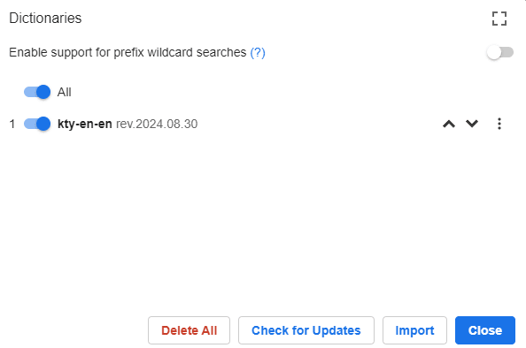
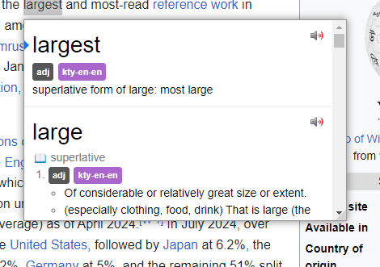

---
hide:
  - navigation
  - footer
---

This introduction will help you quickly familiarize yourself with the basics and set you up for a smooth language learning experience.

Whether you're new to Yomitan or just need a refresher, here you'll find all the essential information you need to begin your journey.

Let's dive in and get started!

---

## Installation

### Chrome

[:fontawesome-brands-chrome: Get Yomitan <small>Chrome/Stable</small>](https://chrome.google.com/webstore/detail/yomitan/likgccmbimhjbgkjambclfkhldnlhbnn){ .md-button .md-button--primary .md-button--stretch }

[:fontawesome-brands-chrome: Get Yomitan <small>Chrome/Beta</small>](https://chrome.google.com/webstore/detail/yomitan-development-build/glnaenfapkkecknnmginabpmgkenenml){ .md-button .md-button--primary .md-button--stretch }

### Firefox

[:fontawesome-brands-firefox-browser: Get Yomitan <small>Firefox/Stable</small>](https://addons.mozilla.org/en-US/firefox/addon/yomitan/){.md-button .md-button--primary .md-button--stretch}

[:fontawesome-brands-firefox-browser: Go To Github Releases](https://github.com/themoeway/yomitan/releases){ .md-button .md-button--primary .md-button--stretch }

<small>※ Unlike Chrome, Firefox does not allow extensions meant for testing to be hosted in the marketplace. You will have to download the desired version and side-load it yourself. You only need to do this once, and you will get updates automatically.</small>

### Edge

[:fontawesome-brands-edge: Get Yomitan <small>Edge/Stable</small>](https://microsoftedge.microsoft.com/addons/detail/yomitan/idelnfbbmikgfiejhgmddlbkfgiifnnn){.md-button .md-button--primary .md-button--stretch}

---

## Basic Usage

Now that you have installed Yomitan, let's explore how you can utilize her features in your language learning journey.

### Quick-actions

Click the  _Yomitan_ button in the browser bar to open the quick-actions popup.

- The  _cog_ button will open the Settings page.
- The  _magnifying glass_ button willopen the Search page.
- The  _question mark_ buttonwill open the Information page.
- The  _profile_ button will appear when multipleprofiles exist, allowing the current profile to be quickly changed.

### Installing Dictionaries

To import the dictionaries you wish to use for term searches. head over to [Dictionary](../dictionaries/index.md) to get set up!

If you do not have any dictionaries installed or enabled. yomitan will warn you that it is not ready for use by displaying an orange exclamation mark over its icon. This exclamation mark will disappear once you have installed and enabled at least one dictionary.

### Scanning Text

Webpage text can be scanned by moving the cursor while holding a modifier key, which is <kbd>Shift</kbd> by default.

If definitions are found for the text at the cursor position, a popup window containing term definitions will open. This window can be dismissed by clicking anywhere outside of it.

### Audio

Click on the  _speaker_ button to hear the term pronounced by a native speaker.

If an audio sample is not available, you will hear a short click instead. For more options, see [Audio Configuration](../advanced/index.md#audio).

### Anki

To further enhance your Yomitan experience, it's worth [integrating with Anki](../anki/index.md), a spaced-repetition flashcard program to help solidify the words you encounter.
