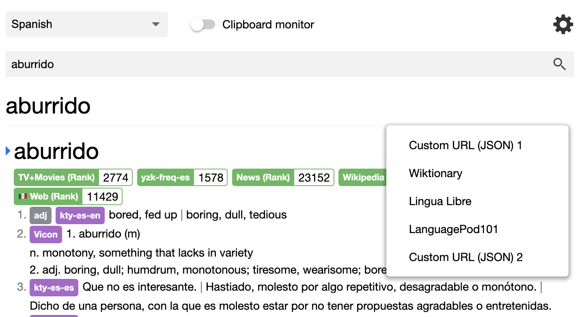
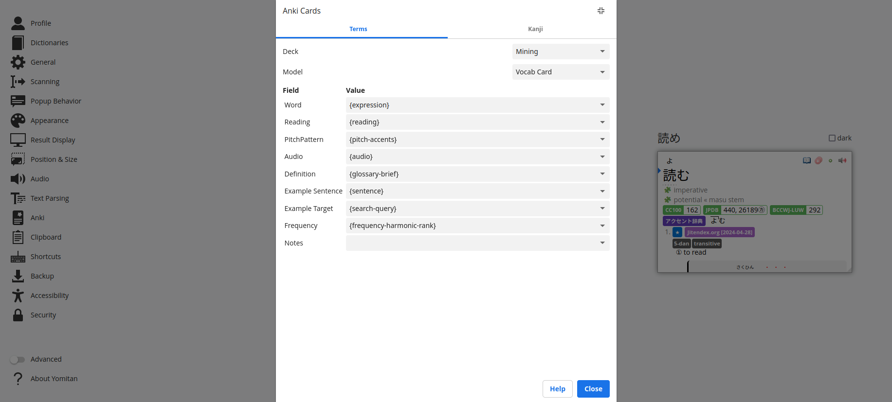

# 
**Yomitan**

## 
Powerful and versatile pop-up dictionary for language learning used by 40,000+ language learners.

[:fontawesome-brands-chrome: Get Yomitan <small>Chrome</small>](https://chrome.google.com/webstore/detail/yomitan/likgccmbimhjbgkjambclfkhldnlhbnn){ .md-button .md-button--primary .md-button--stretch }

[:fontawesome-brands-firefox-browser: Get Yomitan <small>Firefox</small>](https://addons.mozilla.org/en-US/firefox/addon/yomitan/){ .md-button .md-button--primary .md-button--stretch }

[:fontawesome-brands-edge: Get Yomitan <small>Edge</small>](https://microsoftedge.microsoft.com/addons/detail/yomitan/idelnfbbmikgfiejhgmddlbkfgiifnnn){ .md-button .md-button--primary .md-button--stretch }

[Get started](getting-started/index.md){ .md-button .md-button--stretch }

---

## What is Yomitan?

Yomitan turns your web browser into a tool for building language literacy by helping you **read** texts that would otherwise be too difficult to tackle in [a variety of supported languages](./other/supported-languages.md).

-   :speech_balloon:{ .lg .middle } &nbsp;
    __Interactive Popup__

    ---

    Interactive popup definition window for displaying search results.
    { class=on-glb }

-   :mag:{ .lg .middle } &nbsp;
    __Search page__

    ---

    Search page for easily looking up words.

    { class=on-glb }

-   :loud_sound:{ .lg .middle } &nbsp;
    __Audio__

    ---

    Native pronunciation audio with the ability to add your own custom audio sources.

    { class=on-glb }

    ---

    [:octicons-arrow-right-24: More information](./advanced/index.md#audio)
    
-   :earth_asia:{ .lg .middle } &nbsp;
    __Multilanguage Support__

    ---

    Support for more than 20 languages ranging from Japanese to Spanish to Arabic.

    ---

    [:octicons-arrow-right-24: Supported languages](./other/supported-languages.md)

-   :pencil:{ .lg .middle } &nbsp;
    __Flashcards__

    ---

    Automatic flashcard creation for the [Anki](https://apps.ankiweb.net/) flashcard program via the [AnkiConnect](https://foosoft.net/projects/anki-connect) plugin.

    { class=on-glb }

    ---

    [:octicons-arrow-right-24: More information](./anki/index.md)

-   :heart:{ .lg .middle } &nbsp;
    __And Much More__

    ---

    - :book: [Support for multiple dictionaries.](./dictionaries/index.md)
    - :material-cloud-off: Works fully offline. No internet connection needed.
    - :material-wrench: [Extremely customizable. Hotkeys, custom audio, custom appearance.](advanced/index.md)
    - :material-currency-usd-off: Completely free! We don't track your data and we're completely [open-sourced](https://github.com/yomidevs/yomitan).

[Get started](getting-started/index.md){ .md-button .md-button--stretch-max-sm }
